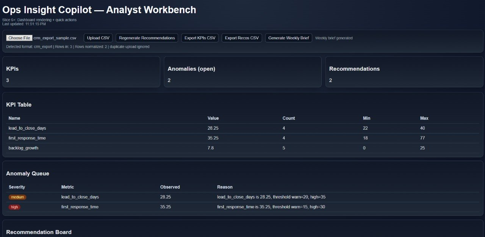
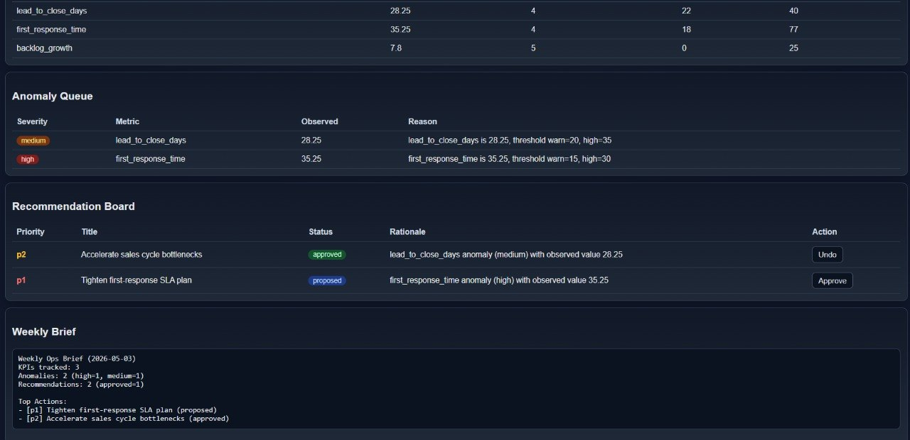

# Ops Insight Copilot (Analyst Workbench)

Local-first analyst dashboard that converts raw operations exports into:
- KPI trends
- anomaly alerts
- prioritized recommendations
- weekly executive brief
- audit/export artifacts

## Why I built this
I built this to solve a common operations pain: analysts spend too much time manually cleaning exports, calculating KPIs, and writing status summaries. The objective was a local-first workbench that turns raw data into clear decisions faster and more consistently.

## Why this project exists
Ops teams often export CSVs from support/CRM systems and then manually clean, analyze, and summarize. This tool standardizes that flow and speeds decision-making with human-in-the-loop controls.

## How teams can use this
- Weekly operations reporting for support/sales/customer teams
- Early anomaly detection with explainable thresholds
- Action planning with priority recommendations and approval controls
- Exportable briefs and CSV outputs for leadership updates and handoffs

## Core capabilities
1. **CSV upload + validation**
2. **Auto-normalization** from multiple source formats:
 - normalized metrics CSV
 - support ticket export
 - CRM lead export
 - ops queue export
3. **KPI computation** (avg/min/max/count)
4. **Anomaly detection** (threshold-based, explainable)
5. **Recommendation generation** (priority + rationale)
6. **Approval + Undo** for recommendations
7. **Weekly brief generation**
8. **CSV exports + audit logging**

## Run
```bash
cd <workspace-home>/openclaw-workspace/ops-insight-copilot-analyst-workbench
npm install
npm run dev
```
Open: `http://<server-ip>:3350/`

## Test
```bash
npm run test
npm run test:slice7
```

## Demo assets
- Walkthrough: [`docs/14-demo-walkthrough.md`](./docs/14-demo-walkthrough.md)
- Screenshots:
 - 
 - 

## Lifecycle docs (fallback list)
Use docs/00..11 for full thought-to-finale process and handoff.


## Quick Install / Run

```bash
# clone repo
git clone https://github.com/callens-james/james-callens-portfolio.git
cd ops-insight-copilot-analyst-workbench

# preferred: Docker
docker compose up --build
```

If Docker is not available, see project-specific local run instructions in this README.


## Legal

Licensed under **AGPL-3.0-only** unless otherwise noted.
See `LICENSE` and `NOTICE`.
